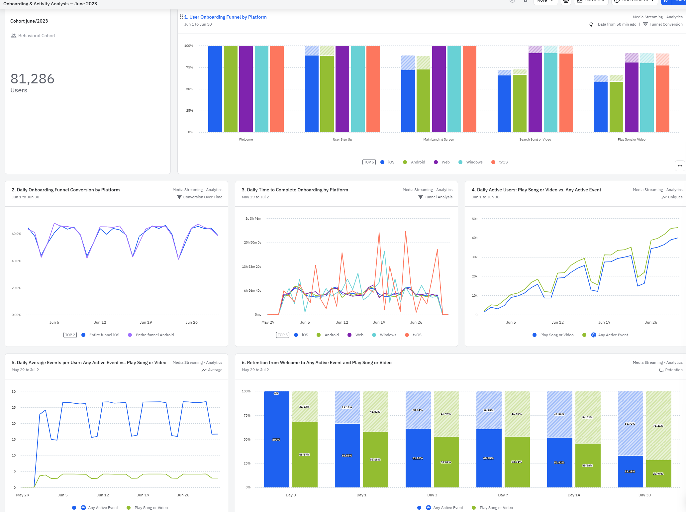

# Analyse des Mobile-Onboardings und der Retention (US-Nutzer, Juni 2023)

## 1. Projektüberblick

Dieses Projekt simuliert die Arbeit eines Product Analysts in einem Musik- und Video-Streaming-Unternehmen.

Ziel war es, das Onboarding-Verhalten neuer mobiler Nutzer aus den USA zu analysieren, Conversion-Raten zu bewerten, Retention zu untersuchen und zentrale Optimierungspotenziale im Nutzerfluss zu identifizieren.

Die Analyse wurde im Amplitude Demo-Projekt „Media Streaming – Analytics“ durchgeführt.

---

## 2. Business-Ziele

Das Produktteam möchte verstehen:

- Wie neue US-Nutzer das mobile Onboarding durchlaufen (iOS & Android)
- Wie hoch die Konversionsrate in jedem Schritt des Funnels ist
- Wie lange Nutzer benötigen, um das Onboarding abzuschließen
- Wie sich die Aktivität nach dem Onboarding entwickelt
- Wie stabil die Retention nach dem ersten Kontakt ist
- Welchen Weg Nutzer von der Registrierung bis zum ersten Content-Konsum nehmen

---

## 3. Definition der Kohorte

Analysierte Kohorte:

**US Mobile Users – Erstes Welcome im Juni 2023**

Filterkriterien:

- Land: Vereinigte Staaten
- Plattform: iOS und Android
- Event: Welcome
- Erstes Auftreten des Events (First Occurrence)
- Zeitraum: 01.06.2023 – 30.06.2023

Gesamtgröße der Kohorte: 81.286 Nutzer

Diese Definition stellt sicher, dass ausschließlich neu gewonnene mobile Nutzer analysiert werden.

---

## 4. Onboarding-Funnel

### Funnel-Schritte (sequenziell):

1. Welcome  
2. User Sign Up  
3. Main Landing Screen  
4. Search Song or Video  
5. Play Song or Video  

### Analysierte Kennzahlen:

- Konversionsrate je Funnel-Stufe
- Drop-off-Analyse
- Breakdown nach Plattform (iOS vs. Android)
- Tägliche Konversionsrate
- Time to Complete Onboarding

---

## 5. Aktivitäts- und Engagement-Analyse

Untersucht wurden:

- Daily Active Users (Play Song or Video vs. Any Active Event)
- Durchschnittliche Anzahl an Events pro Nutzer und Tag
- Entwicklung der Nutzeraktivität im Zeitverlauf

Ziel war es, die Lücke zwischen Interaktion und tatsächlichem Content-Konsum zu bewerten.

---

## 6. Retention-Analyse

Retention wurde gemessen von:

- Welcome → Any Active Event  
- Welcome → Play Song or Video  

Darstellung als Balkendiagramm (Day 0, Day 1, Day 3, Day 7, Day 14, Day 30).

Schwerpunkt:
Identifikation kritischer Abbruchpunkte in der frühen Nutzungsphase.

---

## 7. Journey-Analyse

Mithilfe einer Journey Map wurde untersucht:

- Typische Pfade vom Welcome-Event
- Übergänge zwischen Onboarding-Schritten
- Alternativpfade vor dem ersten Content-Konsum

Ziel:
Erkennen von Reibungspunkten im User Flow und Identifikation möglicher Optimierungspotenziale.

---

## 8. Zentrale Erkenntnisse

### 1. Höchster Drop-off vor dem ersten Content-Konsum

Der stärkste Rückgang erfolgt zwischen:

Search Song or Video → Play Song or Video

Dies deutet auf eine Aktivierungslücke hin:
Nutzer erreichen die Produktoberfläche, konsumieren jedoch nicht zwingend Inhalte.

---

### 2. Plattformübergreifend ähnliche Muster

iOS und Android zeigen sehr ähnliche Konversions- und Retention-Verläufe.

Interpretation:
Optimierungspotenziale liegen im Produktdesign und nicht in plattformspezifischen technischen Faktoren.

---

### 3. Kritische Phase: Erste 24 Stunden

Die Retention fällt signifikant von Day 0 auf Day 1.

Schlussfolgerung:
Die Time-to-Value muss weiter reduziert werden, um frühe Abwanderung zu verhindern.

---

### 4. Interaktion ≠ Content-Konsum

Die Anzahl „Any Active Events“ ist deutlich höher als „Play Song or Video“.

Das Produkt erzeugt Interaktion, aber nicht in ausreichendem Maße Content-Nutzung.

---

## 9. Handlungsempfehlungen

1. Schnellere Aktivierung
   - Automatische Content-Empfehlungen nach Sign Up
   - Klarer „Start Now“-CTA
   - Personalisierte Startseite

2. Optimierung der Suchfunktion
   - Vorschläge und Trending Content
   - Verbesserte Relevanz

3. Verbesserung der Day-1-Retention
   - Push-Benachrichtigungen
   - E-Mail mit personalisierten Empfehlungen
   - „Continue Watching“-Funktion

4. Reduktion der Time-to-First-Value
   Ziel: < 5 Minuten bis zum ersten Content-Konsum

---

## 10. Verwendete Methoden & Skills

- Kohortendefinition mit Event-Filtern
- Funnel-Analyse mit sequenziellen Schritten
- Segmentierung nach Plattform
- Time-to-Convert-Analyse
- Retention-Analyse
- Journey Mapping
- Strukturierung eines produktorientierten Dashboards

---

## 11. Ziel des Projekts

Dieses Projekt demonstriert die Fähigkeit:

- Onboarding-Prozesse datenbasiert zu analysieren
- Conversion- und Retention-Treiber zu identifizieren
- Produktentscheidungen mit quantitativen Erkenntnissen zu unterstützen
- Business-relevante Handlungsempfehlungen abzuleiten

## Dashboard Preview

